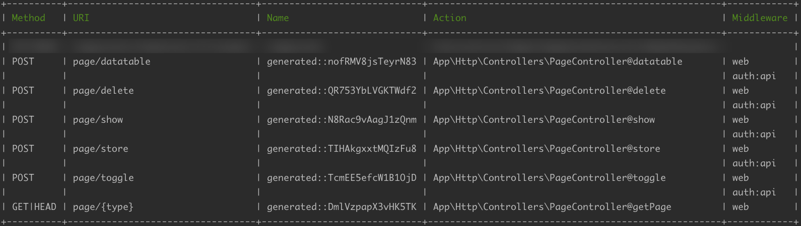

Page
---------------------------
Publishing with the repeat working such as privacy policy and terms & conditions page.



## Installation

```
composer require asorasoft/page
```

Register `PageServiceProvider` in `config/app.php` file

```php
return [
    /*
     * Package Service Providers...
     */
    Asorasoft\Page\Providers\PageServiceProvider::class,
];
```

Publish `page.php` configuration file

```shell
php artisan vendor:publish --tag=page-config  --force
php artisan optimize
php artisan migrate
```

and you can modify those the directory.

```php
<?php

return [
    'route' => [
        'frontend' => 'routes/Api/Frontend',
        'backend' => 'routes/Api/Backend',
    ],
    'controller' => [
        'frontend' => 'app/Http/Controllers/Api/Frontend',
        'backend' => 'app/Http/Controllers/Api/Backend',
    ],
    'types' => [
        'privacy-policy' => 'privacy-policy',
        'terms-and-conditions' => 'terms-and-conditions',
    ],
    'view' => 'resources/views'
];
```

Publish routes, model, migration, controller and view files

```shell
php artisan vendor:publish --tag=page-resource --force
```
## Usage

### Dummy Data

```shell
composer dumpautoload
php artisan db:seed --class=PageTableSeeder
```

### Routes Registration

Copying those lines into ``routes/web.php`` file

```php
Route::get('legal/{type}/{locale?}', 'PageController@getPage');
include_once ('Api/Backend/page.php');
include_once ('Api/Frontend/page.php');
```

## License

This package is open-sourced software licensed under the [MIT license](https://opensource.org/licenses/MIT).
